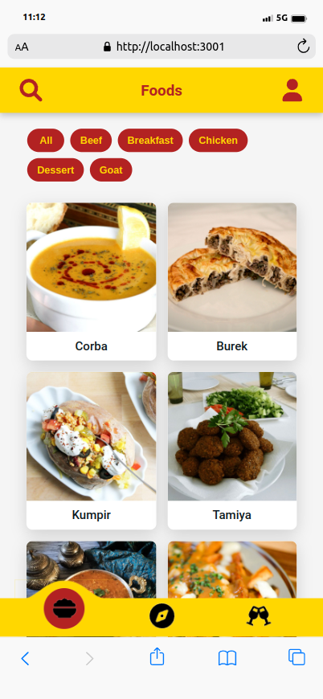
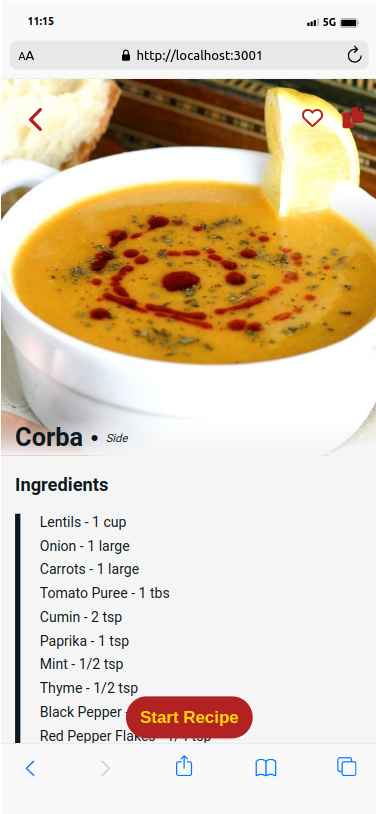
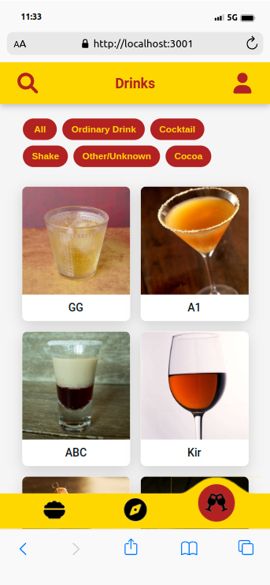

# Recipes App
<div> 
  
  
  
</div>

## 💻 Projeto

O Recipes App foi um projeto em equipe para a finalização do módulo de Front-end da [Trybe](https://www.betrybe.com/). Com o Recipes App você pode pesquisar receitas de comidas e bebidas, separadas por tipo e até país de origem. Além disso, você consegue favoritar uma receita e até iniciá-la. Acesse o link [PROJETO]() para ver o deploy do projeto e ver seu uso.

⚠️ : O projeto foi feito pra ser acessado em até 768px de largura (tablet), justamente pra simular um aplicativo. Recomendo que acesso o site com essa resolução no navegador desktop ou acesso pelo seu dispositivo móvel.

## 🚀 Tecnologias

Esse projeto foi desenvolvido com as seguintes tecnologias:

Front-end:

> Desenvolvido usando: React, React-hooks React-router, Styled-Components, CSS3, HTML5, Javascript

## 📌 Habilidades

Nesse projeto, fui capaz de:

- Desenvolver softskills como colaboração e comunicação pra trabalho em equipe
- Aprender melhor o uso de metodologias ágeis com o scrum.
- Usar o Styled-Component pela primeira vez

## ⬇️ Instalando dependências

Realize o clone do projeto ou faça download dos arquivos e extraia.

Baixe, então, as dependências do projeto usando o seguinte comando no bash:

```bash
cd recipes-app/ && npm install
```

## ⚡ Executando a aplicação

Caso você ja esteja na pasta do projeto, execute:

```bash
npm start
```

Caso contrário:

```bash
cd recipes-app/ && npm start
```

## 🤝 Colaboradores

Agradeço às seguintes pessoas que fizeram esse projeto junto comigo:

<table>
  <tr>
    <td align="center">
      <a href="https://github.com/julianoboese">
        <br>
        <sub>
          <b>Juliano Boese</b>
        </sub>
      </a>
    </td>
    <td align="center">
      <a href="https://github.com/byancaknorst">
        <br>
        <sub>
          <b>Byanca Knorst</b>
        </sub>
      </a>
    </td>
    <td align="center">
      <a href="https://github.com/brennomiliani">
        <br>
        <sub>
          <b>Brenno Miliani</b>
        </sub>
      </a>
    </td>
  </tr>
</table>

[⬆ Voltar ao topo](#Recipes-App)<br>
<br>

_Template de README.md de [@thiagodanobrega](https://github.com/thiagodanobrega/template-repositorio)_
